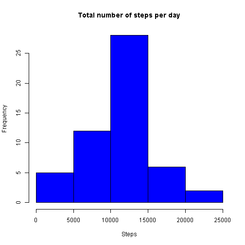
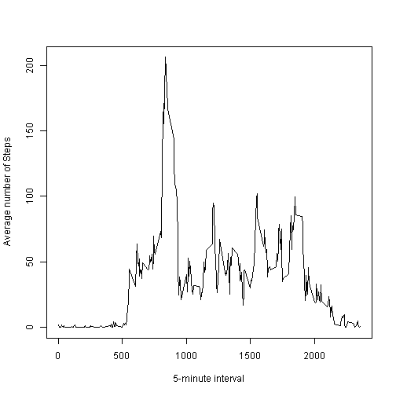
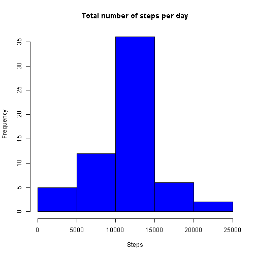
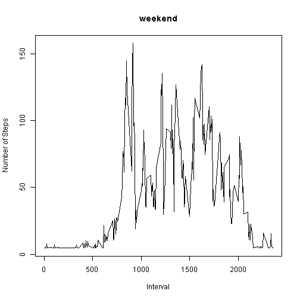
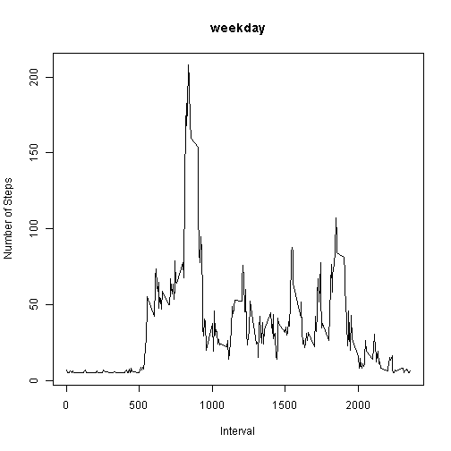

## Reproducible Research - Peer Assessment 1
### Author: Amit Kumar Das


This is an R Markdown document submitted as a part of Reproducible Research course of Data Science Specialization track. 


```r
library(dplyr)
```

```
## 
## Attaching package: 'dplyr'
## 
## The following object is masked from 'package:stats':
## 
##     filter
## 
## The following objects are masked from 'package:base':
## 
##     intersect, setdiff, setequal, union
```

#### Loading and preprocessing the data


```r
dataset <- read.csv("./activity.csv", header = TRUE)

valid_data <- filter(dataset, is.na(steps) != TRUE)
```


#### What is mean total number of steps taken per day?


```r
result <-
  valid_data %>%
  group_by(date) %>%
  summarize(
            sum_steps = sum(steps)
  )

hist(result$sum_steps, col = "blue", xlab = "Steps", main = "Total number of steps per day")
```

 


```r
mean_step_daily <- mean(result$sum_steps)
```

Mean of total steps per day: **1.0766189 &times; 10<sup>4</sup>**
  
  

```r
median_step_daily <- median(result$sum_steps)
```


Median of total steps per day: **10765**


#### What is the average daily activity pattern?


```r
result1 <-
  valid_data %>%
  group_by(interval) %>%
  summarize(
            mean_steps = mean(steps)
  )

plot(result1$interval, result1$mean_steps,  type = "l", xlab = "5-minute interval", ylab = "Average number of Steps")
```

 

```r
toprow <- result1 %>%
            select(mean_steps, interval) %>%
              arrange(desc(mean_steps)) %>%
                head(1)
top_interval <- toprow$interval
```

5-minute interval, on average across all the days in the dataset, containing the maximum number of steps: **835**.


```r
invalid_data <- filter(dataset, is.na(steps) == TRUE)
row_count <- nrow(invalid_data)
```


#### Imputing missing values

Total number of rows with missing values in the datase : **2304**.

As a strategy for filling in all of the missing values in the dataset, let's use the mean for steps for all 5-minute intervals across all days, i.e. the overall mean for the field 'step'. Let's create a new dataset that is equal to the original dataset but with the missing data filled in.


```r
filled_invalid_data <- mutate(invalid_data, steps = mean_step_daily / 288)

all_filled_data <- rbind(valid_data, filled_invalid_data)

missed_data_rowcount <- nrow(filter(all_filled_data, is.na(steps) == TRUE))
```

Total number of rows with missing values in the datase : **0**.

Creating the revised Histogram with the filled in dataset:


```r
result2 <-
  all_filled_data %>%
  group_by(date) %>%
  summarize(
            sum_steps = sum(steps)
  )

hist(result2$sum_steps, col = "blue", xlab = "Steps", main = "Total number of steps per day")
```

 


```r
mean_step_daily <- mean(result2$sum_steps)
```

Mean of total steps per day: **1.0766189 &times; 10<sup>4</sup>**
  

```r
median_step_daily <- median(result2$sum_steps)
```

Median of total steps per day: **1.0766189 &times; 10<sup>4</sup>**


The Value of mean does not differ as the missing values have been filled-in with the overall mean of the field 'step'. 

However, the value of median, because of the change in position in the distribution, changes to some extent.


#### Are there differences in activity patterns between weekdays and weekends?


```r
mod_dataset <- mutate(all_filled_data, week_end_flag = (weekdays(strptime(all_filled_data$date,"%Y-%m-%d")) == "Saturday" |weekdays(strptime(all_filled_data$date,"%Y-%m-%d")) == "Sunday" ))

mod_dataset_wkdays <- filter(mod_dataset, week_end_flag == FALSE)
mod_dataset_wkend <- filter(mod_dataset, week_end_flag == TRUE)


plot1_dataset <-
  mod_dataset_wkend %>%
  group_by(interval) %>%
  summarize(
            mean_steps = mean(steps)
  )

plot2_dataset <-
  mod_dataset_wkdays %>%
  group_by(interval) %>%
  summarize(
            mean_steps = mean(steps)
  )

plot(plot1_dataset$interval, plot1_dataset$mean_steps,  type = "l", xlab = "Interval", ylab = "Number of Steps", main = "weekend")
```

 

```r
plot(plot2_dataset$interval, plot2_dataset$mean_steps,  type = "l", xlab = "Interval", ylab = "Number of Steps", main = "weekday")
```

 

**Conculsion:** In weekend, the steps are relatively uniform and continuous for most of the time intervals duing the day signifying movement of the subjects throughout the day. 

However, in the weekday, lot of movement is seen in the morning but later on the number of steps is much less throughout the day. This is probably because subjects are probably doing work involving less physical movement throughout the day.
